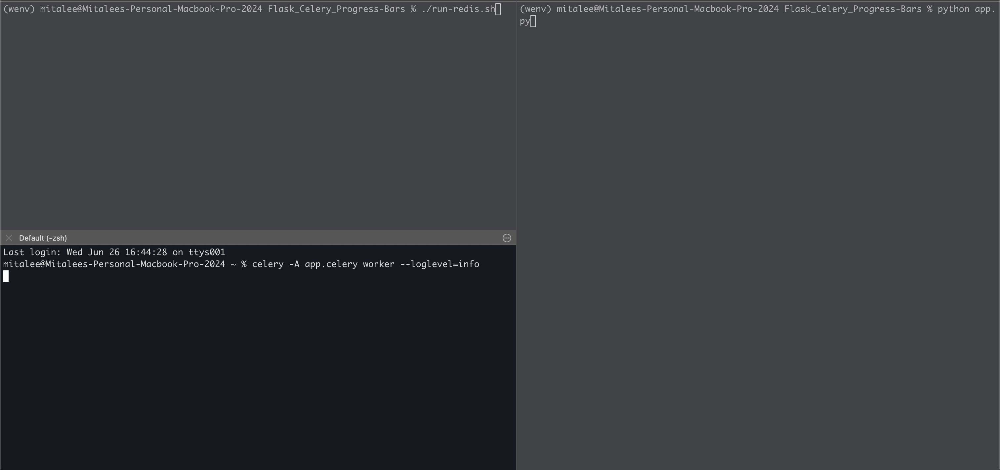
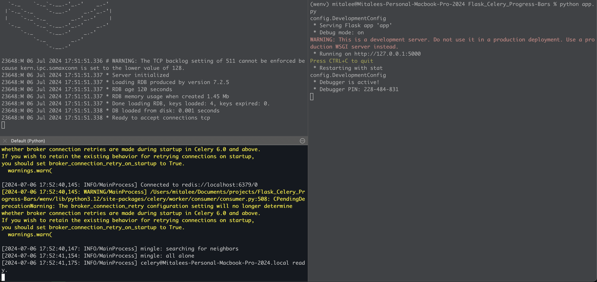
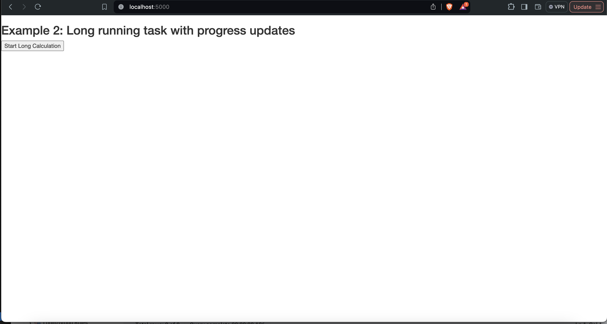
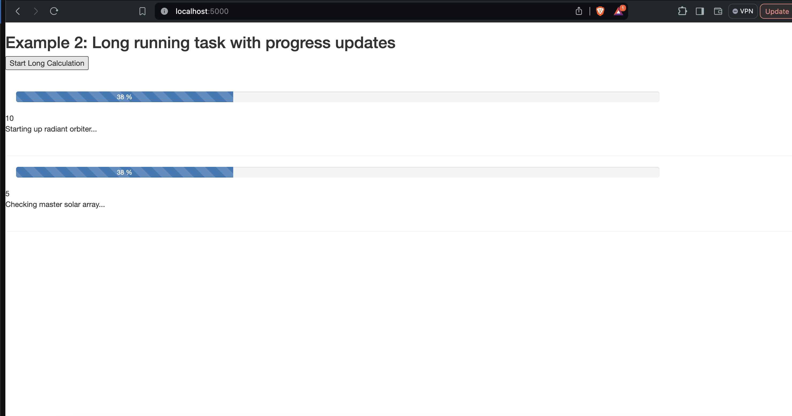
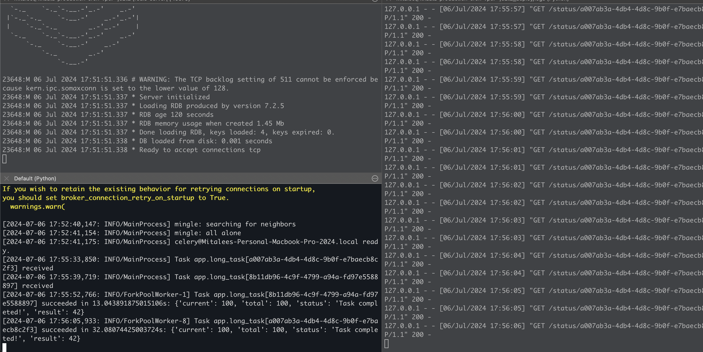

I wasn't able to find a single, all-in-one resource for hosting a small Async task queue implementation (backend worker with frontend progress bar) on Heroku, so I pulled [Miguel Grinberg's Tutorial for a Celery based Progress Bar on Flask](https://blog.miguelgrinberg.com/post/using-celery-with-flask), and deployed the same with redis on a single free tier dyno on Heroku.

Update 7/2024:
--------------

1. Updated requirements.txt
2. Added .env file and allowed loading of the APP_SETTINGS
3. Open 3 terminal shells.
4. On each shell, activate virtual environment:
    a. `python -m venv wenv`
    b. `source wenv/bin/activate`
5. Start redis, celery and flask:
    a. Shell 1 - run redis `./run-redis.sh`
    b. Shell 2 - run celery `celery -A app.celery worker --loglevel=info`
    c. Shell 3 - run flask `python app.py`
6. Navigate to `localhost:5000` on browser
7. Start Long task
8. The progress bar will start showing up
















Old steps:
---------
Steps on Local:
`
export APP_SETTINGS="config.DevelopmentConfig"
`

```bash
python app.py
celery worker -A app.celery --loglevel=info
./run-redis.sh
```

Steps for Heroku:
Note: Heroku requires credit card verification for allowing the Heroku Redis add-on to be configured on the free dyno.

Modify the Procfile accordingly and make sure the celery worker is switched on in the 'Resources' Tab on the Heroku dashboard.

For the Heroku environment, the redis URL can be found from [this](https://devcenter.heroku.com/articles/heroku-redis#provisioning-the-add-on) documentation: 

Specifically, the following command will display the redis URL:
```bash
heroku config | grep REDIS
```
Add the redis URL to the staging or the Production Environment in config.py.
